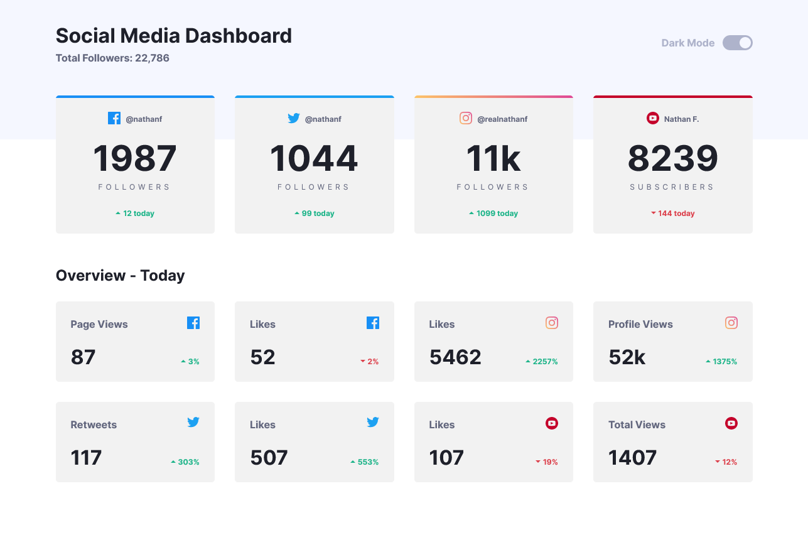

### Frontend Mentor - Social media dashboard with theme switcher 

### The challenge

Users should be able to:

- View the optimal layout for the site depending on their device's screen size
- See hover states for all interactive elements on the page
- Toggle color theme to their preference

### Screenshot

### Built with

- Semantic markup
- CSS Grid, Flexbox and Custom Properties
- Typescript
- [React](https://reactjs.org/) - JS library
- [Next.js](https://nextjs.org/) - React framework
- [Vanilla Extract](https://vanilla-extract.style/) - Typescript zero-runtime styles

### What I learned

This is the first time I built a project with screen-reader testing from the beginning. Using a screen-reader I made sure the markup was comprehensible and navigable before adding any styles and interactivity. The theme toggle button is styled using the `aria-pressed` state to ensure styling remains linked with the accessible markup. I chose appropriate heading levels and landmark regions to allow easy navigation through the content. At all times I repeatedly tested with the keyboard to ensure focus order and focus stylings were in place.

Some of the decisions made by the designer resulted in some accessibility audit fails. I adjusted the design so the base font-size was 1rem = 16px. Some of the colors were too low contrast. I used the Wave Accessibility browser plugin to take the failing colours and adjust their saturation and lightness until they met WCAG guidlines while still staying as close as possible to the designers original colour choices. This was made much easier by using CSS Properties for design tokens, so colours could be changed in a single place. This made it easier to adjust the contrast for the different themes too.

I used NextJs to build this. While this site is not full stack, and just uses mock data, the components are the same as they would be in a production app. As NextJS will statically generate the initial render this adds challenges for theming. The colour theme for a site should respect the user's preferences as defined in `@media (prefers-color-scheme)`, and if the user has selected a different preference for the site, this should be stored for next time. But on a static site, neither of these things are known at build time so without extra work the user may see a flash of the incorrect theme.

To solve this I added a tiny inline script that will run before the html is parsed on the client and set a property on the `document` element based on user preferences from localstorage or system settings. This will not block rendering for long (unlike full rehydration of the app) and means the chosen theme will be available as soon as the browser paints. To avoid the toggle switch being initially in the wrong position when statically rendered, I've wrapped it in a custom `<ClientSideOnly>` component so it will not render on the server. This means it will only display once the user preference is known, and not flash the wrong state.

Using Vanilla Extract for CSS made it very straightforward to use CSS Custom Properties throughout the project without having to worry about naming clashes, or typing errors. It makes switching themes significantly easier too, and as it compiles to pure CSS at build-time, brings no run-time cost.
